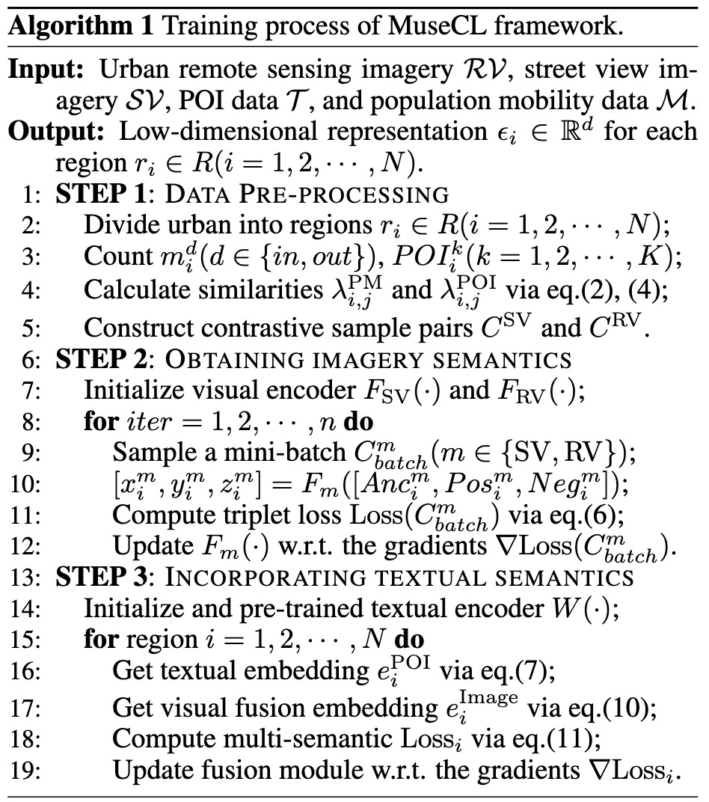

# MuseCL - IJCAI2024 (AI and Social Good)

The repo is the official implementation for our IJCAI2024 paper in AI and Social Good Track: **MuseCL: Predicting Urban Socioeconomic Indicators via Multi-Semantic Contrastive Learning**.

## Overview

This multi-step contrastive learning model consists of **three key components: extracting semantic features from the visual modality, incorporating textual semantic information, and performing downstream tasks.**

To begin, we partition the visual semantic learning module into remote sensing imagery representations based on POI similarity and street view imagery representations based on population flow similarity. Contrastive learning sample pairs are curated to acquire imagery features with distinct focal points. Subsequently, we take into account the POI text information associated with each region and leverage a pre-trained encoder-based model to derive the text features for every region. Then, employing a feature-level attentive fusion module, we align the combined remote sensing and street view features with the text representation vectors of each region, thereby imbuing the fused features with both visual and textual semantic insights. Lastly, we evaluate the low-dimensional representations of each region across a range of downstream tasks.

## Details of Dataset

#### Region division

Before representing regions, partitioning the smallest units is necessary. Common methods include irregular road networks, square grids, and hexagonal grids.

Road network segmentation in (a) uses urban transportation networks to divide cities into regions of various sizes and shapes. Drawbacks include complex shapes hindering multi-modal data processing and lack of standardized representation. In practice, the common approach is regular shape-based division. The depicted division in the (b) employs a square-based technique, segmenting the city into uniform squares. This method suits urban areas with regular terrain and road layouts but lacks variation.

To combine road network and square division strengths, hexagonal division emerges as a flexible and inventive choice. In hexagonal division, regions are staggered, allowing adjacency to six regions for better correlation. This approach accommodates irregular road networks and topography, resulting in richer urban spatial configurations. Thus, we choose hexagonal segmentation to partition urban representation units as shown in (c).

#### Urban multi-modal datas

In line with the framework, data collection entails gathering street view images, remote sensing images, POI data, and population mobility data.

- **Street view images.** It can be acquired by Baidu Map and Google Map API. Sample locations for images can be chosen along the road network using ArcGIS, and a certain number of panoramic images can be obtained. Finally, each image is divided into four segments: 0° - 90°, 90° - 180°, 180° - 270°, and 270° - 360°.

- **Remote sensing images.** It can be acquired via the satellite imagery interface in Google Earth. These images can then be cropped into individual minimal representation units, adjusting their size according to the specific region divisions within different cities.

- **POI data.** It is gathered by Baidu Map and OpenStreetMap (OSM), including time, ratings, comments' content, and locations, etc. Incomplete data is excluded. The resulting dataset retains the POI name, comment content, POI label, and latitude/longitude coordinates.

- **Population mobility.** We employ cab travel patterns over a specific timeframe to approximate the flow of people in each region. For instance, in Beijing, weekly trajectories of 10,357 cabs from 02/02/2008 to 08/02/2008 are utilized, comprising a dataset of 15 million points and a total trajectory distance of 9 million kilometers.

Following data collection and preprocessing, the datasets for the three cities are summarized in table below. 

#### Socio-economic indicators

To provide a comprehensive showcase of our model's predictive capabilities across diverse urban attributes, an array of region characteristics has been chosen for experimentation in this study. The data sources and their links are provided as follows.

- **Population Density.** Beijing \& Shanghai \& New York: WorldPop, https://www.worldpop.org/.
- **Housing Density.** Beijing \& Shanghai: Lianjia, https://m.lianjia.com/.
- **Number of POIs/Reviews.** Beijing \& Shanghai: Baidu Map API, http://api.map.baidu.com. New York: OpenStreetMap, https://www.openstreetmap.org/.
- **Population Mobility.** Beijing: Microsoft Research, https://www.microsoft.com/en-us/research/. Shanghai: HKUST, https://cse.hkust.edu.hk/scrg/. New York: Kaggle, https://www.kaggle.com/datasets.
- **Crime Data.** NewYork: NYC Open Data, https://opendata.cityofnewyork.us/.

## Details of Experiment

Algorithm below summarizes the training process of our proposed MuseCL framework for fine-grained urban region profiling.

## Usage

#### Environment

- Python >= 3.9
- torch == 2.2.1 + cu121

#### Dependencies

1. Install Pytorch with the correct CUDA version.
2. Use the `pip install -r requirements.txt` command to install all of the Python modules and packages used in this project.

#### Model Training and Predicting

1. Download the data from the url above into `\prediction-tasks\data`, and use the code in`\pre-processing` to pre-process the raw data.
2. Use `\street-view\sv_train.py` and `\remote-view\rv_train.py` to obtain the feature representations of the street view images and remote sensing images in each area, respectively.
3. Use `\attentive-fusion\fusion_module.py` to obtain the region representation vector after fusion multi-semantics, and save them into `\prediction-tasks\emb`.
4. Use `\prediction-tasks\mlp_pytorch` to predict each socio-economic indicator.

## Results

